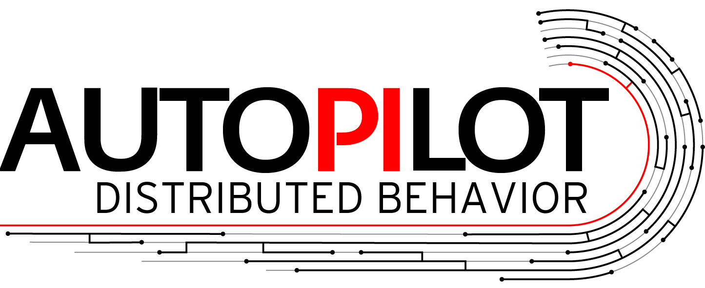

 

 
 

# Autopilot

Distributed behavioral experiments with lots of Raspberry Pis

Read the Docs                                                                | 
:---------------------------------------------------------------------------:|:--------------:
 | 

(links to docs, homepage, paper, discussion board, hardware (coming soon))

Autopilot is a complete hardware/software experimental framework that integrates 
everything from task design, to data management. It was designed with three
primary design priorities:

* **Flexibility** - Autopilot can use any hardware to run any task. It eliminates the need
  for researchers to use a patchwork of mutually incompatible tools to perform complex
  experiments. Its complete API-level documentation lets users hack the entire library
  to use it however they need to.
* **Efficiency** - Autopilot uses Python as a glue around high-performance, low-level libraries,
  and is fully concurrent across multiple threads, processes, and computers. Its distributed
  design eliminates the hard limits faced by by single-computer
  systems, letting researchers use arbitrary numbers and combinations of hardware components
  to perform complex, hardware-intensive experiments at scale.
* **Reproducibility** - Autopilot offers obsessive documentation of data provenance,
  logging the entire history of an Animal's training, including any version and local
  code changes. By integrating every part of the experiment and producing data that is
  clean at the time of acquisition, Autopilot makes it easy to do good science -- allowing
  exact experimental replication from a single file. 

# Modules

(module icon overview)

# Documentation

For instructions on getting started, see LINK TO THE DOCS. To get started, users just need 
a LINK TO RASPBERRY PI and a handful of inexpensive electronic components. We have designed
a set of easily-manufactured 3d-printable components that we are excited to release
as soon as possible!

Our onboarding documentation is quite new, so don't be shy LINK TO THE DISCUSSION BOARD
and LINK TO RAISING ISSUES.

# What's new?

LINK TO CHANGELOG, SUMMARY OF CHANGELOG

# What's next?

LINK TO TODO, SUMMARY OF TODO

README coming soon, for now 

* [Read the paper](https://www.biorxiv.org/content/10.1101/807693v1)for an introduction,
* [Read the docs](http://docs.auto-pi-lot.com) to get started,
* [Visit the site](https://auto-pi-lot.com) for more.
